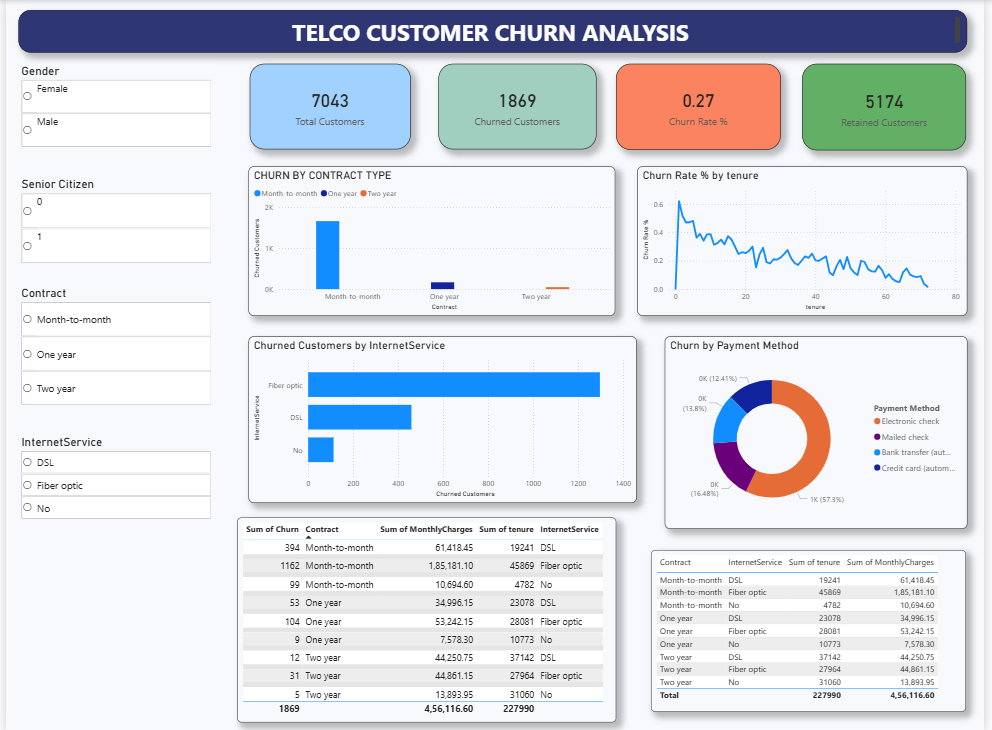

# Telco Customer Churn Analysis (Power BI)

## About the Project
Customer churn is a common problem in the telecom industry. In this project, I worked on a telecom customer dataset to understand customer behavior and identify the main reasons why customers are leaving.

I created an interactive Power BI dashboard that helps analyze churn based on contract type, tenure, internet service, payment method, and other customer details.

---

## Objective
The main goal of this project is to:
- Find the overall churn rate
- Identify customer groups with high churn
- Understand which services and contracts lead to more churn
- Create a clean and interactive dashboard for analysis

---

## Tools Used
- Power BI
- DAX
- CSV dataset
- Data modeling and visualization

---

## Dashboard Features
- KPI cards showing:
  - Total customers
  - Churned customers
  - Churn rate
  - Retained customers
- Churn analysis by:
  - Contract type
  - Internet service
  - Payment method
  - Customer tenure
- Interactive slicers for filtering data
- Table view for detailed customer-level insights

---

## Key Observations
- Customers with month-to-month contracts have the highest churn
- Customers with lower tenure are more likely to churn
- Fiber optic internet users show higher churn compared to DSL
- Customers using electronic check as payment method churn more frequently

---

## Data Cleaning & Preparation
Before building the dashboard, the data was cleaned by:
- Fixing inconsistent category values
- Handling missing values
- Creating calculated columns and measures using DAX
- Ensuring correct data types for analysis

---

## Dashboard Preview

---

## Conclusion
This project helped me understand how customer data can be used to analyze churn and support better business decisions. The dashboard allows users to explore the data easily and identify churn patterns through interactive visuals.
